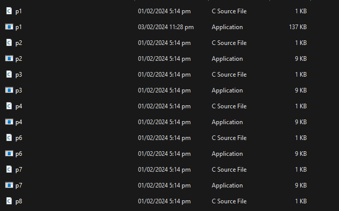
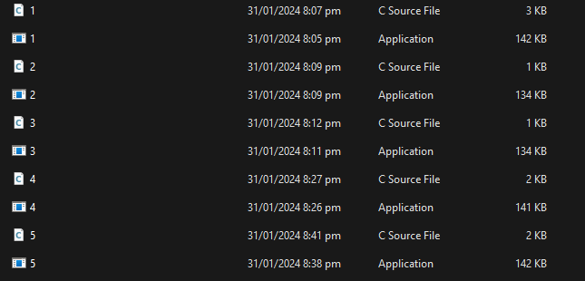

## Installation

1. Clone the repository or download the source code.
2. Install the required dependencies by running the following command:

   ```shell
   pip install -r requirements.txt

## Usage
Change the path variable to the variable which is required in your system. i.e Where the Assignment folders are located like this:- <br>
 <br/>
and inside this the files(just .c files donot worry about the other files) must look like one of these two pictures:- or 